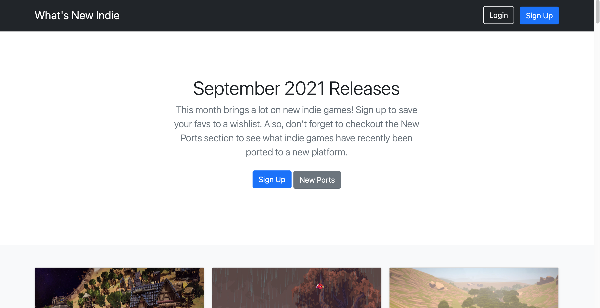
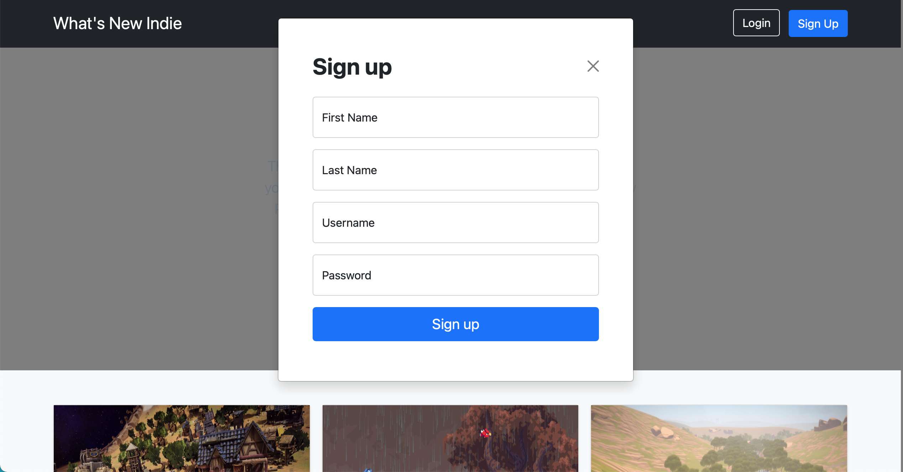
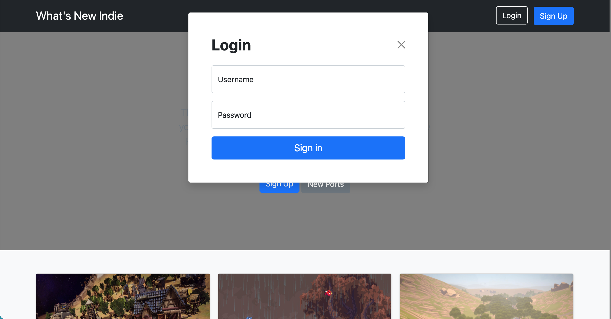
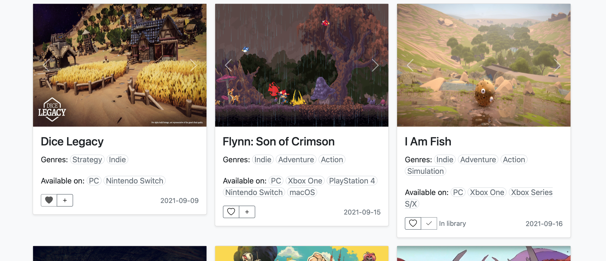
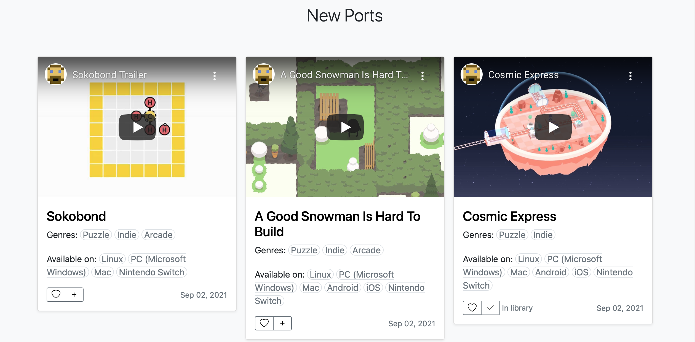
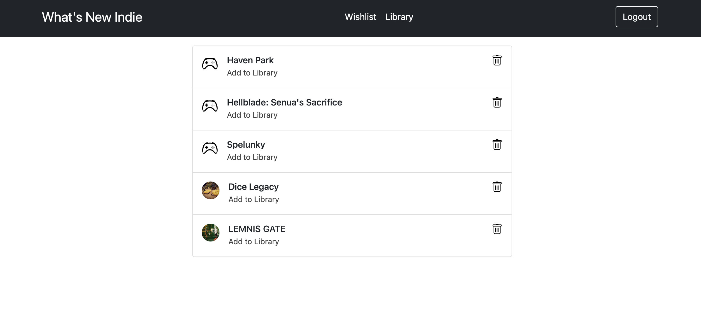
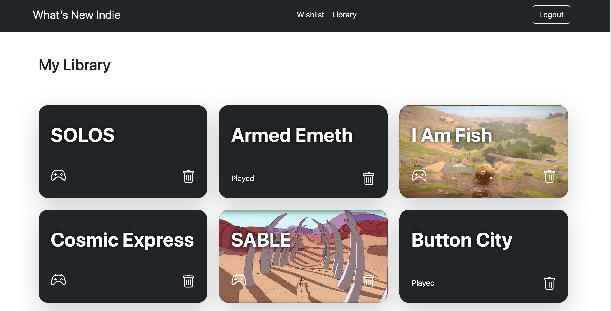

# What's New Indie

With all the hype around the newest AAA video games, it can be difficult to find the smaller games. That's where this project comes in. This web app showcases the newest indie video game releases. Specifically, it shows indie video games that are available on PC and at least one other platform (console or mobile). Each video game card shows screenshots of the game, genres, which platforms it is available on, and release date. Users can sign up for an account to save games to a wishlist or library. Users can mark a game in their library as "played", move games from their wishlist to their library, or remove games from their wishlist or library. There is also a New Ports section that shows older indie video games that were recently ported to a new platform. The video game cards under the ports sections have a trailer, summary, genres, platforms, and release date. Users can also add these games to their lists. 

## Tech Stack

* Python
* Flask
* SQLAlchemy
* PostgreSQL
* Bootstrap
* HTML/CSS
* APIs (RAWG, IGDB)

## Features
Landing Page:
 
Sign up/Login Modals:
 
 
Indie Video Game Cards:
 
 
Wishlist:
 
Library:
 
